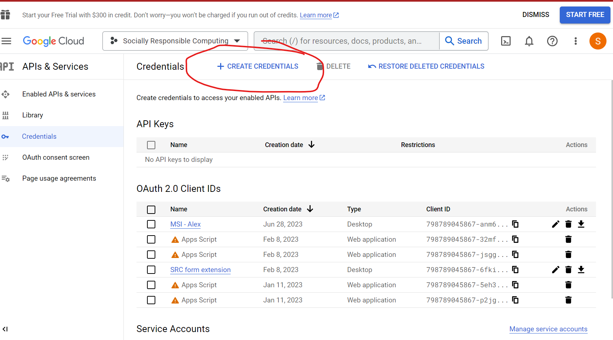

# Google Form Extension: Git File Upload

This is a Google Forms extension that uploads documents to a repository on submission of a form. The user should fill out the form and include their documents and upon submission the information and the document will be version controlled on an external Github repository

## Table of Contents
- [Google Form Extension: Git File Upload](#google-form-extension-git-file-upload)
  - [Table of Contents](#table-of-contents)
  - [Introduction to Google Form Extension: Git File Upload](#introduction-to-google-form-extension-git-file-upload)
  - [Purpose:](#purpose)
  - [Use Cases:](#use-cases)
- [Developer Setup](#developer-setup)
    - [Prerequisites](#prerequisites)
    - [Setup](#setup)
    - [Test Run](#test-run)
  - [Important Commands](#important-commands)
  - [Important Links:](#important-links)
    - [This is the link to the form where the code is deployed to](#this-is-the-link-to-the-form-where-the-code-is-deployed-to)
    - [This is where the logs are viewable](#this-is-where-the-logs-are-viewable)
    - [This is where the deployed code resides](#this-is-where-the-deployed-code-resides)
    - [This is where you create OAuth 2.0 credentials](#this-is-where-you-create-oauth-20-credentials)

## Introduction to Google Form Extension: Git File Upload

In today's digital age, with an increasing reliance on cloud-based systems, the amalgamation of form submissions and version control has become more important than ever. Google Forms is a prominent tool used by many to collect information, feedback, and other data types. On the other hand, Git, especially through platforms like GitHub, is the go-to solution for version control, enabling users to track changes, collaborate efficiently, and maintain a historic record of files. Bridging the gap between these two platforms is the "Google Form Extension: Git File Upload."

## Purpose:

The primary objective of the Google Form Extension: Git File Upload is to seamlessly integrate Google Forms and GitHub. This means that when a user submits a form containing documents or other file types, the information doesn't just get stored in the typical Google Sheets backend. Instead, it also gets uploaded to a designated GitHub repository, ensuring the files are version controlled. This addition not only augments the data integrity and recovery but also eases collaborative efforts, where team members can collectively view or work on submitted documents.

## Use Cases:

Educational Institutions: Professors can use this tool to collect assignments, ensuring that students' work is archived and accessible for future reference.
Businesses: Companies can utilize the extension to receive and version-control project proposals, designs, or any document submissions from team members or external collaborators.
Research: In fields where documentation is continuously updated, like tech or medical research, the extension can aid in maintaining a clear version history of contributions.
Public Submissions: Any organization seeking public inputs, be it for feedback, design competitions, or content contributions, can use this extension to manage and archive the received data.
Examples:

Design Feedback: A company launching a new product line can create a form for internal teams to submit design feedback. When team members submit their feedback along with design files, every piece of feedback, along with the associated files, gets stored in a GitHub repository. This allows the design team to check the version history, understand the evolution based on feedback, and collaboratively improve the design.
Course Assignments: In a coding course, students can submit their coding assignments through the form. The instructor can then review each student's submission on GitHub, track improvements over time, and even provide feedback directly on the platform.
Document Verification: In scenarios where the public needs to submit identification documents for verification purposes, the extension ensures that every version of the submitted document is available, safeguarding against potential modifications or loss of data.
In the sections that follow, you'll find a detailed developer setup guide that will assist you in integrating this functionality into your own Google Forms. It covers everything from prerequisites to a test run, ensuring you can leverage this powerful tool efficiently.

# Developer Setup

This guide will walk you through the setup process for creating a Google Form extension using Google Apps Script and CLASP. The extension allows you to add custom functionality and automation to your Google Forms.

### Prerequisites

Before you begin, make sure you have the following prerequisites installed:

- **Node.js**: You can download and install Node.js from the official website: [Node.js](https://nodejs.org)
- **CLASP**: CLASP (Command Line Apps Script Projects) is a command-line tool used for managing Google Apps Script projects. Install CLASP globally by running the following command:
  ```bash
  npm install -g @google/clasp
  ```
 - Google Clasp allows you to deploy the project as a google form extension

### Setup

1. Clone the project from github
   `git@github.com:SociallyResponsibleComputing/Form-Extension.git`  

2.  Login to https://console.cloud.google.com/apis/credentials?authuser=0&project=socially-responsible-computing and create new oAuth2.0 credentials:
   


*Choose desktop Application when it asks you for the type of credentials*

3. Download the credentials as JSON and save it to the root directory of the project. Rename the credentials file to creds.json

4. Inside the root directory there is a .clap.json file, make sure the root directory points to the path of your cloned directory

5. Next login using the freshly downloaded creds.json `clasp login --creds creds.json`

You should now be ready for development. Let's do a test to make sure everything is wokring

### Test Run
- Open a terminal inside the project and run 'clasp run HelloWorld' and you should see the following output: "Hello World!"
- If that succeeds, you have successfully setup your development environment
- Check the logs to verify that the code ran: https://script.google.com/u/0/home/projects/1EPqaSsc9UfkhVfQ_C6K4TjRY7PQYY0bvJq-37hcRZB2zg11DcwUzn4cP/executions

## Important Commands
- **clasp push** -This pushes the code to the google apps script project which effectively deploys the code
- **clasp run \<function>** - This runs the code on the google apps script project. It is used for testing functions in the app prior to deplyment. You must specify a function to run as defined in the code


## Important Links:
### This is the link to the form where the code is deployed to
https://forms.gle/v9kitcKe45XMQ4SA6
### This is where the logs are viewable
https://script.google.com/u/0/home/projects/1EPqaSsc9UfkhVfQ_C6K4TjRY7PQYY0bvJq-37hcRZB2zg11DcwUzn4cP/executions
### This is where the deployed code resides
https://script.google.com/u/0/home/projects/1EPqaSsc9UfkhVfQ_C6K4TjRY7PQYY0bvJq-37hcRZB2zg11DcwUzn4cP/edit?pli=1
### This is where you create OAuth 2.0 credentials
https://console.cloud.google.com/apis/credentials?authuser=0&project=socially-responsible-computing
